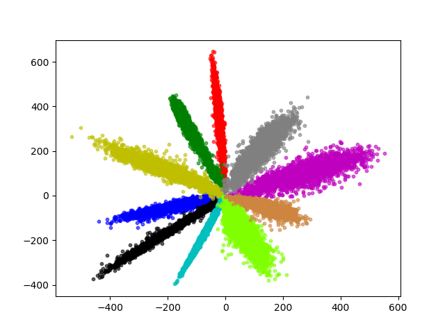
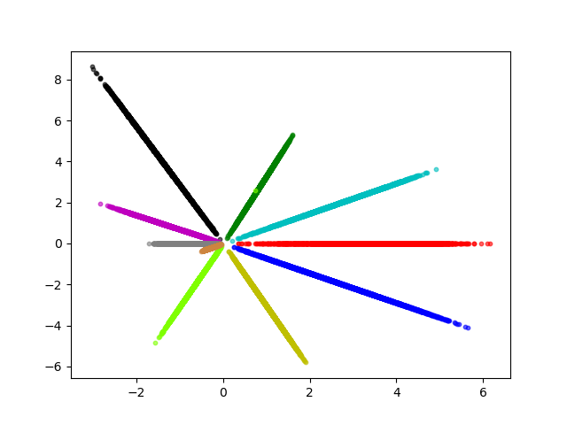
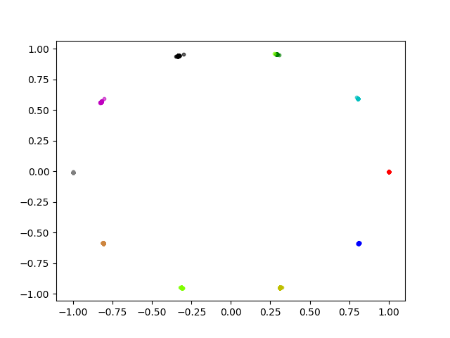

# Some Face Losses with tensorflow.

## Abstract
This is a tensorflow re-implemetation of some Face Losses, Such as Cos Loss...
I only do some "toy experiments" with mnist and compare the performance by visual the features.

## Compare

1、softmax Loss

2、cosLoss
s = 24. m = 0.2. The visualization is amazing !

3、More Face Losses ...
